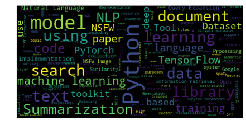

# github_wordcloud

Generate wordclouds from Github repositories information

Usage:

Fetching user's starred repositories

`python -m github_wordcloud --username {Github username} --extracted_information topics`

By default `--extracted_information` is set to `topics`, but you can also use `description` or `description_keywords` (keywords are extracted using gensim's TextRank)

